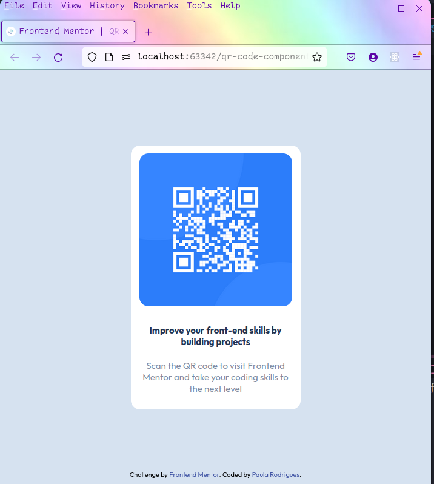

# Frontend Mentor - QR code component solution

This is a solution to the [QR code component challenge on Frontend Mentor](https://www.frontendmentor.io/challenges/qr-code-component-iux_sIO_H). 

## Table of contents

- [Overview](#overview)
  - [Screenshot](#screenshots)
    - [Desktop View](#desktop-view)
    - [Mobile View](#mobile-view)
  - [Links](#links)
  - [Built with](#built-with)
- [Author](#author)

## Overview

This is my first project on Frontend Mentor.

### Screenshots

#### Desktop View

#### Mobile View

### Links

- Solution URL: [Solution](https://www.frontendmentor.io/challenges/qr-code-component-iux_sIO_H/hub/qr-code-component-with-flexbox-PqI4nET8tY)
- Live Site URL: [Add live site URL here](https://qr-code-component.paulaabro.com)

### Built with

- Semantic HTML5 markup
- Flexbox
- Mobile-first workflow
- Media Queries

## Author

- Frontend Mentor - [@pullynnnha](https://www.frontendmentor.io/profile/pullynnhah)
